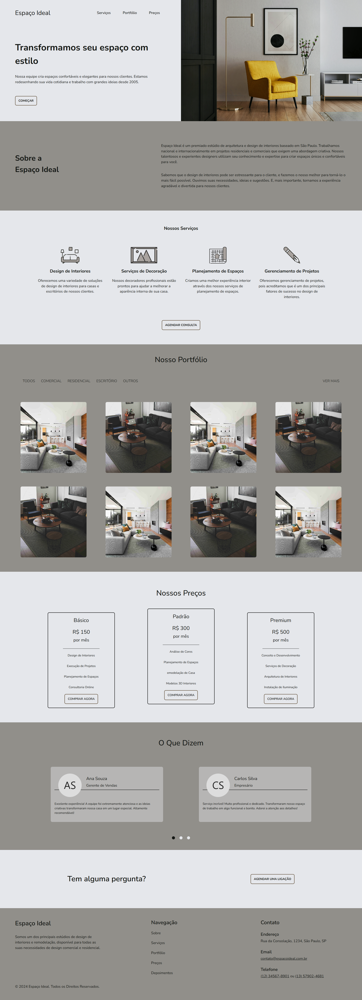

# Espaço Ideal

Uma landing page conceitual para um site de design de interiores. Este projeto foi desenvolvido como parte do meu portfólio, com o objetivo de demonstrar habilidades técnicas e criatividade no desenvolvimento de interfaces modernas e responsivas.

## 🛠️ Tecnologias Utilizadas

- **HTML**
- **SCSS**
- **ViteJS**

## 🚀 Instalação e Configuração

Siga os passos abaixo para executar o projeto localmente:

1. Clone o repositório:

   ```sh
   git clone https://github.com/AdrianoLima19/espaco-ideal
   cd espaco-ideal
   ```

1. Instale as dependências:

   ```sh
   npm install
   ```

1. Inicie o servidor de desenvolvimento:

   ```sh
   npm run dev
   ```

    O projeto será iniciado e estará disponível em [http://localhost:5000/](http://localhost:5000/).

## 📸 Captura de Tela



### 📄 Créditos

- Imagens: Obtidas no [Unsplash](https://unsplash.com)
- Ícones: Disponibilizados pelo [FontAwesome](https://fontawesome.com/)
